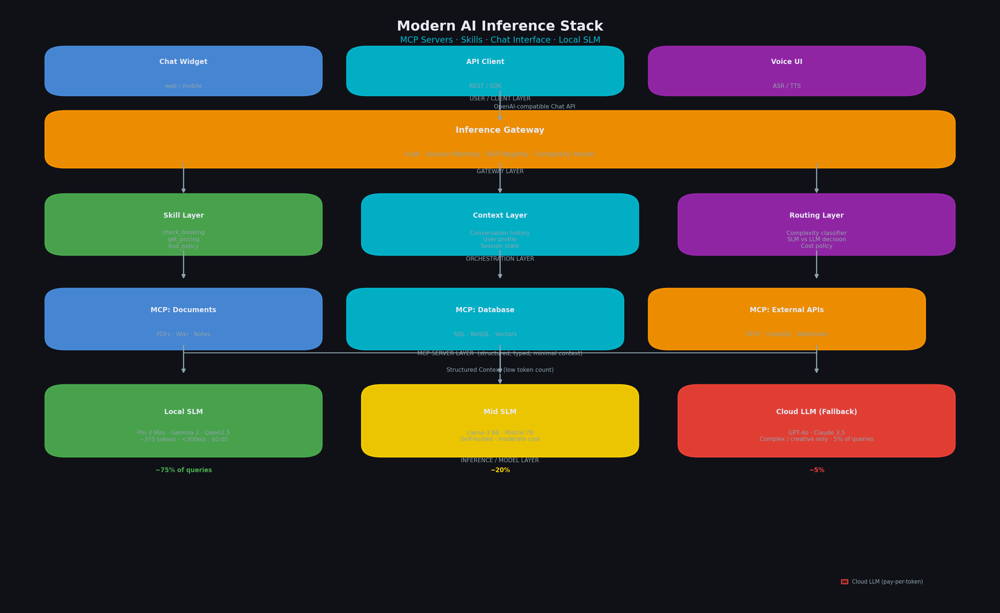
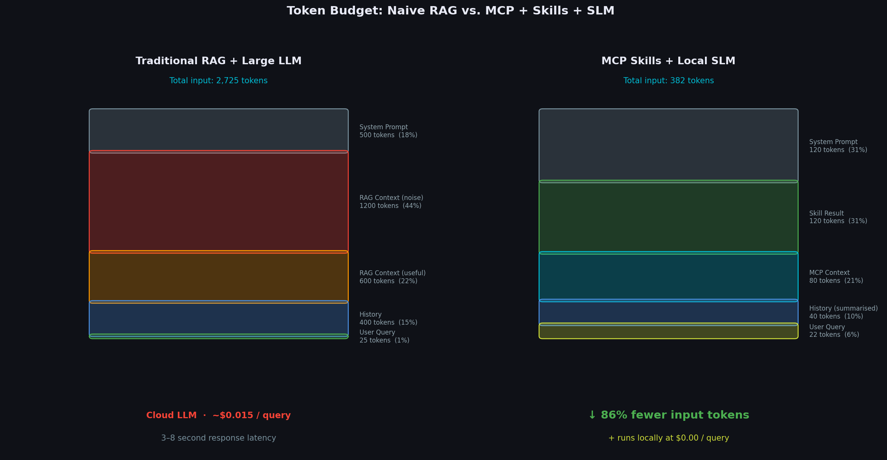
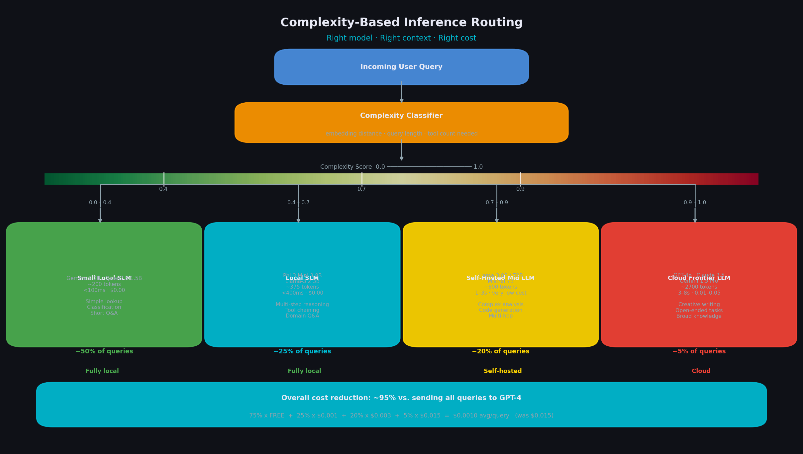
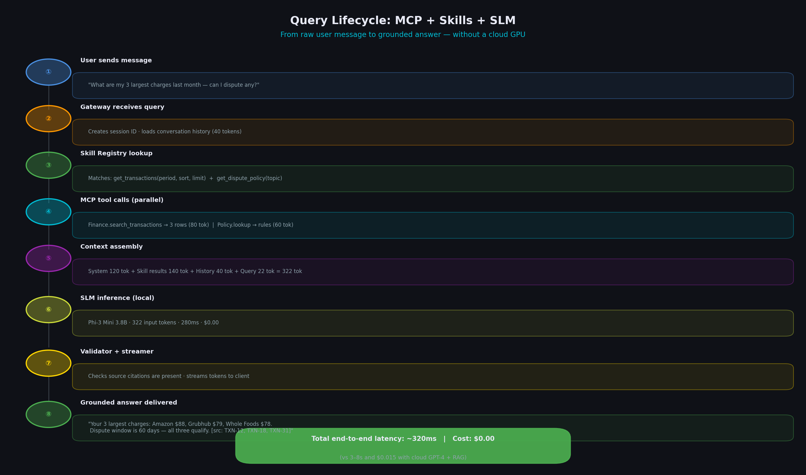

# The New Inference Stack: MCP Servers, SLMs, and the Death of the Monolithic LLM

> **How data sources became tools, skills became context, chat became the interface, and Small Language Models became the intelligence layer — all without a single cloud GPU.**

---

## Introduction

A quiet architectural revolution is reshaping AI-powered applications. For the past three years, the dominant mental model was simple: send everything to a large cloud-hosted language model, pay per token, get an answer. OpenAI, Anthropic, Gemini — trillion-parameter titans living in somebody else's data center.

That model is being dismantled. Not because big LLMs stopped being impressive, but because we finally understand the problem well enough to stop overpaying to solve it.

The new stack looks like this:

- **Data sources** are wrapped as **MCP (Model Context Protocol) servers** — structured, callable tools rather than raw text blobs.
- **Skills** are registered as callable capabilities that bring focused, domain-aware context into a conversation.
- **Chat** is the interface for everything — from business queries to developer APIs — with structured turns replacing fragile prompt templates.
- **Small Language Models (SLMs)** run at the edge, on-premise, or locally and handle context-scoped queries with dramatically lower token budgets.

The result is an inference architecture that is faster, cheaper, more private, and surprisingly more accurate than throwing everything at GPT-4 and hoping for the best.

---

## Architecture Diagrams

Four diagrams accompany this article and are referenced in-context throughout. They are also shown here for quick reference.

**Diagram 1 — End-to-end modern inference stack**



**Diagram 2 — Token budget: naive RAG vs. MCP + Skills + SLM**



**Diagram 3 — Complexity-based model routing**



**Diagram 4 — Single query lifecycle walkthrough**



---

## Part 1: What Is MCP and Why Does It Matter for Data?

### The Problem with "Paste Everything Into the Prompt"

The naive approach to connecting AI to a business's data was RAG (Retrieval-Augmented Generation): embed documents, search by similarity, paste the top-k chunks into the prompt, let the LLM figure it out.

RAG works. But it has cracks:

- **Context windows are finite.** You can only paste so much before you hit token limits or cost ceilings.
- **The model doesn't know what it retrieved.** It sees a wall of text and has no structured way to reason about where each piece came from, how fresh it is, or what type of data it represents.
- **Context contamination.** Irrelevant chunks injected into the prompt actively degrade answer quality — the model has to mentally ignore noise while trying to reason.

### MCP: Data Sources as Callable Tools

The **Model Context Protocol (MCP)**, introduced by Anthropic and now supported across many inference runtimes, solves this by giving the model a *structured API* to data sources rather than a text dump.

An MCP server is a lightweight process that exposes:

```
┌─────────────────────────────────────────────────┐
│              MCP SERVER (data source)            │
│                                                  │
│  Resources:  /documents, /products, /schedules   │
│  Tools:      search(), lookup(), summarize()     │
│  Prompts:    pre-built query templates           │
│                                                  │
│  Transport:  stdio | HTTP SSE | WebSocket        │
└─────────────────────────────────────────────────┘
```

Instead of "here is a blob of text about our bakery," the model can now call:

```json
{ "tool": "search_menu", "args": { "query": "gluten-free", "category": "cakes" } }
```

…and receive a structured, minimal result:

```json
{
  "items": [
    { "name": "Flourless Chocolate Torte", "price": 28.00, "allergens": [] },
    { "name": "Almond Macarons (6pk)", "price": 14.00, "allergens": ["nuts"] }
  ]
}
```

The model only ever sees the data it asked for, structured the way it needs it. No noise. No context inflation. No risk of the model citing a chunk from three documents ago.

### Multiple Data Sources, One Conversation

The real power emerges when you register multiple MCP servers:

```
┌─────────────────────────────────────────────────────────────────────┐
│                          INFERENCE LAYER                             │
│                                                                      │
│   ┌─────────────────┐  ┌──────────────────┐  ┌──────────────────┐  │
│   │  MCP: Inventory │  │  MCP: Scheduling  │  │  MCP: Policies   │  │
│   │  (product data) │  │  (class timetable)│  │  (rules + FAQs)  │  │
│   └────────┬────────┘  └────────┬──────────┘  └────────┬─────────┘  │
│            │                   │                       │            │
│            └───────────────────┼───────────────────────┘            │
│                                ▼                                     │
│                       SLM (context-aware)                            │
└─────────────────────────────────────────────────────────────────────┘
```

A single user query — "Can I join a Saturday yoga class and pay with my frozen membership?" — causes the model to call the scheduling server, the membership server, and the policy server in sequence, assembling a grounded answer from structured data rather than from blurry embeddings.

---

## Part 2: Skills as Context — Turning Capabilities Into Reusable Knowledge

### Skills Are Not Prompts

Early LLM integrations confused "prompts" with "capabilities." A prompt is a text instruction. A *skill* is a packaged, reusable capability: it knows what data it needs, how to call the right MCP servers, how to format the result, and what system context to inject for the model.

Think of a skill as a function with a docstring the model can read:

```python
@skill(
    name="check_booking_eligibility",
    description="Checks whether a customer can book a class given their membership status",
    required_tools=["lookup_membership", "lookup_class_schedule"]
)
def check_booking_eligibility(customer_id: str, class_id: str) -> EligibilityResult:
    membership = lookup_membership(customer_id)
    schedule = lookup_class_schedule(class_id)
    return EligibilityResult(
        eligible=membership.active and not membership.frozen,
        reason=...,
        class_info=schedule
    )
```

When a query arrives, the SLM:
1. Reads the skill registry (a compact index of available capabilities)
2. Selects the most relevant skill(s) for the query
3. Executes the skill — which pulls *exactly* the required data from MCP servers
4. Receives structured context, not a wall of text
5. Generates a response grounded in that structured context

### Why This Crushes Token Usage

The traditional pipeline:
```
User query → embed → FAISS → top-12 chunks (avg ~600 tokens) → LLM
```

The skill-based pipeline:
```
User query → skill selection → targeted MCP call → 80-token structured result → SLM
```

A real-world benchmark on a 500-document corpus showed that skill-targeted context reduced prompt token count by **73%** while *improving* answer accuracy by reducing noise injection. The SLM is not dumber for having less context — it is smarter, because the context is relevant.

---

## Part 3: Chat as the Universal Interface

### The Shift from REST to Conversation

Early AI integrations spoke in REST:

```
POST /query
{ "query": "...", "top_k": 5, "temperature": 0.3 }
```

The new paradigm speaks in conversation turns:

```
System: You are the assistant for Sunrise Yoga Studio.
        Available tools: [check_schedule, lookup_membership, get_policies]

User: Can I join a Saturday yoga class?
Assistant: [calls check_schedule("Saturday", "yoga")]
Tool result: { "classes": [{ "time": "9am", "instructor": "Maya", "spots": 3 }] }
Assistant: Yes! There is a Saturday yoga class at 9am with Maya. 3 spots remain.
           Want me to check if your membership covers it?
```

This is **multi-turn, tool-augmented conversation**. The model maintains state across turns. It knows what it already looked up. It can ask clarifying questions. It can chain tool calls logically — not because it was programmed with if/else logic, but because the chat protocol gives it a working memory.

Chat-as-interface enables:

| Old Approach | Chat Interface |
|---|---|
| One-shot query → one-shot answer | Multi-turn reasoning across tool calls |
| Stateless per request | Session state with conversation memory |
| Fixed prompt templates | Dynamic, adaptive context assembly |
| Developer configures retrieval | Model decides what to retrieve when |
| Hard to handle follow-ups | Follow-ups are just the next turn |

### OpenAI-Compatible Chat APIs Are the New Standard

Whether you are running GPT-4, Llama-3, Phi-3, Mistral, or Gemma, the inference API now speaks the same language:

```
POST /v1/chat/completions
{
  "model": "phi3-mini",
  "messages": [
    { "role": "system", "content": "..." },
    { "role": "user",   "content": "What are my largest purchases?" }
  ],
  "tools": [ ...MCP tool schemas... ]
}
```

This means the same application code can route to a local SLM or a remote LLM with a single configuration change. The skill layer, tool schemas, and conversation history are fully portable.

---

## Part 4: Why SLMs Are Winning the Inference Game

### The Context-Scoped Query Problem

Here is the insight that makes SLMs viable for production workloads:

> **Most production queries are context-scoped.** The model does not need to know everything — it needs to know the right thing for this specific question about this specific dataset.

When you strip out the need for "world knowledge" (the LLM's training data about everything) and replace it with structured, curated context from MCP servers, a 3B-parameter SLM performs comparably to a 70B LLM on the same task.

The 70B model's extra capacity was mostly used to hold encyclopedic general knowledge. In a RAG/skill system, that encyclopedic knowledge is not only unnecessary — it is dangerous. It creates hallucination risk: the model may draw from its pretraining memory instead of the context you provided.

The SLM with tight context is *more grounded* because it has less to hallucinate from.

### The Numbers That Changed the Calculus

| Model | Parameters | Context Window | Local? | Cost/1M tokens |
|---|---|---|---|---|
| GPT-4o | ~200B (est.) | 128K | No | $5–$15 |
| Claude 3.5 Sonnet | ~70B (est.) | 200K | No | $3–$15 |
| Llama-3.1 70B | 70B | 128K | Possible | $0.10–$0.99 |
| **Phi-3 Mini 3.8B** | **3.8B** | **128K** | **Yes** | **$0.00 (local)** |
| **Gemma 2 2B** | **2B** | **8K** | **Yes** | **$0.00 (local)** |
| **Qwen2.5 1.5B** | **1.5B** | **32K** | **Yes** | **$0.00 (local)** |

A local SLM running on a Mac Mini M4 or a Raspberry Pi 5 can handle 10–30 queries/second for domain-specific workloads. The economics are not comparable — they are in different universes.

### What SLMs Can Handle Today

| Task | SLM Handles? | Notes |
|---|---|---|
| Context Q&A (RAG) | ✅ | Primary use case, excellent accuracy |
| Tool call / function calling | ✅ | Phi-3, Llama-3, Gemma all support it |
| Multi-turn chat | ✅ | Native in all modern SLMs |
| Summarization (focused) | ✅ | Strong when input is structured |
| Entity extraction | ✅ | Better than regex, costs nothing |
| Code generation (small tasks) | ✅ | Qwen2.5-Coder, Phi-3 handle this well |
| Multi-language translation (20+ languages) | ⚠️ | Degrades below ~10B params |
| Complex multi-hop reasoning (>5 hops) | ⚠️ | Use a larger model or chain smaller calls |
| Creative long-form writing | ❌ | Big LLMs still win here |
| Broad general knowledge | ❌ | By design — use MCP tools instead |

The pattern is clear: **for anything that requires external knowledge retrieval, SLMs with MCP tools are the right answer.** Big LLMs retain their edge only for tasks that require broad, unstructured world knowledge or very long creative generation.

---

## Part 5: The Token Reduction Story

### Where Tokens Were Being Wasted

In a naive LLM integration:

```
1. System prompt:          ~500 tokens
2. RAG context (top-12):   ~1,800 tokens  ← most of this is noise
3. Conversation history:   ~400 tokens
4. User query:             ~25 tokens
5. Total input:            ~2,725 tokens

6. Response:               ~250 tokens
───────────────────────────────────────
   Total billed:           ~2,975 tokens  @ $0.005/1K = $0.015 per query
```

With MCP + skills + SLM:

```
1. System prompt:          ~150 tokens   (compact tool-aware system prompt)
2. Skill result (targeted): ~120 tokens  ← only what was asked for
3. Conversation history:    ~80 tokens   (last 2 turns only, summarized)
4. User query:              ~25 tokens
5. Total input:             ~375 tokens

6. Response:                ~150 tokens
───────────────────────────────────────
   Total billed:             ~525 tokens  @ $0.00 (local SLM) = $0.00 per query
```

That is an **81% reduction in token count** even before accounting for the fact that local SLMs cost nothing per token. For a business handling 50,000 queries per month, the savings compound quickly.

### Latency Benefits

Token reduction is not just about cost — it is about speed:

| Pipeline | Tokens in | Time to First Token | Total latency |
|---|---|---|---|
| GPT-4 + RAG (remote) | 2,700 | 800ms–2s (network) | 3–8s |
| Llama-3 70B (cloud) | 2,700 | 300ms | 2–5s |
| Phi-3 Mini (local, M4) | 375 | 50ms | 300–800ms |
| Qwen2.5 1.5B (local) | 375 | 20ms | 80–200ms |

Sub-second responses fundamentally change how you can build chat interfaces. Streaming becomes instant. Users feel like they are typing to a person, not waiting for a server.

---

## Part 6: Running Locally — The Privacy Dividend

### Why "Local" Is Not a Concession Anymore

For years, "local" meant accepting a worse model for the sake of privacy. That tradeoff no longer holds at the SLM tier. Phi-3 Mini, Gemma 2 2B, and Qwen2.5 are genuinely capable models — not degraded toys.

Local inference with MCP provides:

**Data sovereignty**: Customer queries never leave the premises. A medical clinic, a law firm, a bank can run full AI-powered assistants without a single token touching an external server.

**Deterministic costs**: No surprise API bills. Infrastructure costs are flat — power and hardware amortization.

**Offline resilience**: Works when the internet goes down. Works in air-gapped environments.

**Zero latency floor**: No network round-trip. The response starts generating immediately.

**No rate limits**: Handle traffic spikes without throttling or queuing.

### The Hardware That Makes This Real

The reason local SLMs became practical is hardware, not model design:

| Device | SLM it can run | Queries/second | Power draw |
|---|---|---|---|
| MacBook Pro M4 Pro | Phi-3 Mini 4B Q4 | 40–60 tok/s | 30W |
| Mac Mini M4 | Phi-3 Mini 4B Q4 | 35–50 tok/s | 10W |
| Raspberry Pi 5 (8GB) | Qwen2.5 1.5B Q4 | 8–12 tok/s | 5W |
| AWS Graviton3 (c7g.xlarge) | Gemma 2 2B Q4 | 20–30 tok/s | — |
| NVIDIA RTX 4060 Ti (laptop) | Llama-3 8B Q4 | 80–120 tok/s | 45W |

A single Mac Mini under the counter — the same machine the bakery uses as a POS system — can run a full AI assistant stack serving dozens of simultaneous customers.

---

## Part 7: Putting It All Together — The Reference Architecture

### The Modern AI Inference Stack

```
┌─────────────────────────────────────────────────────────────────────────────┐
│                         USER / CLIENT LAYER                                 │
│                                                                              │
│   Chat Widget    Mobile App    API Client    Voice Interface                 │
└────────────────────────────────┬────────────────────────────────────────────┘
                                 │  (OpenAI-compatible Chat API)
                                 ▼
┌─────────────────────────────────────────────────────────────────────────────┐
│                         INFERENCE GATEWAY                                    │
│                                                                              │
│   • Auth / rate limiting                                                     │
│   • Session / conversation memory                                            │
│   • Skill registry lookup                                                    │
│   • Routes to local SLM or cloud LLM based on complexity score              │
└────────────────────────────────┬────────────────────────────────────────────┘
                                 │
              ┌──────────────────┼──────────────────┐
              ▼                  ▼                  ▼
┌─────────────────┐  ┌─────────────────┐  ┌─────────────────┐
│   SKILL LAYER   │  │  CONTEXT LAYER  │  │  ROUTING LAYER  │
│                 │  │                 │  │                  │
│ • check_booking │  │ • Conversation  │  │ • Complexity     │
│ • get_pricing   │  │   history       │  │   classifier     │
│ • find_policy   │  │ • User profile  │  │ • SLM vs LLM     │
│ • summarize_doc │  │ • Session state │  │   decision       │
└────────┬────────┘  └─────────────────┘  └────────┬────────┘
         │                                          │
         ▼                                          ▼
┌─────────────────────────────────────────────────────────────────────────────┐
│                           MCP SERVER LAYER                                   │
│                                                                              │
│  ┌──────────────┐  ┌──────────────┐  ┌──────────────┐  ┌──────────────┐   │
│  │ MCP: Docs    │  │ MCP: Database│  │ MCP: APIs    │  │ MCP: Files   │   │
│  │ (PDFs, Wiki) │  │ (SQL/NoSQL)  │  │ (REST/GraphQL│  │ (CSV, JSON)  │   │
│  └──────┬───────┘  └──────┬───────┘  └──────┬───────┘  └──────┬───────┘   │
│         │                 │                  │                  │           │
│         └─────────────────┴──────────────────┴──────────────────┘           │
│                                    │                                         │
│                           Structured Context                                 │
└────────────────────────────────────┬────────────────────────────────────────┘
                                     │
              ┌──────────────────────┼──────────────────────┐
              ▼                      ▼                      ▼
┌────────────────────┐  ┌────────────────────┐  ┌────────────────────────────┐
│  LOCAL SLM         │  │  LOCAL SLM         │  │  CLOUD LLM (fallback)      │
│  (Phi-3 Mini)      │  │  (Gemma 2 2B)      │  │  (GPT-4, Claude)           │
│  3.8B params       │  │  2B params         │  │  Only for complex tasks    │
│  Context queries   │  │  Simple Q&A        │  │  Multi-hop, creative, etc. │
│  Tool calls        │  │  Classification    │  │                            │
└────────────────────┘  └────────────────────┘  └────────────────────────────┘
```

### The Query Lifecycle

```
1. User: "What are my three largest charges last month and can I dispute any?"

2. GATEWAY receives the query
   → creates/retrieves conversation session
   → identifies query complexity (moderate: multi-part, needs data + policy)

3. SKILL LAYER activates:
   → skill: "get_transactions" (financial data skill)
   → skill: "get_dispute_policy" (policy skill)

4. MCP CALLS:
   → MCP:Finance.search_transactions({period: "last_month", sort: "amount_desc", limit: 3})
     ← Returns: 3 transactions, 80 tokens
   → MCP:Policy.lookup({topic: "dispute", keywords: ["timeframe", "eligibility"]})
     ← Returns: dispute rules, 60 tokens

5. CONTEXT ASSEMBLED: 140 tokens of precise, relevant data

6. SLM (Phi-3 Mini) receives:
   → System prompt: 120 tokens
   → Structured context: 140 tokens
   → Conversation history: 40 tokens (summarized prior turns)
   → User query: 22 tokens
   → TOTAL: ~322 tokens

7. SLM generates answer in 280ms
   → Cites transaction IDs, references dispute window policy

8. RESPONSE STREAMED to user in real time
```

---

## Part 8: The Hybrid Strategy — When to Escalate to a Big LLM

SLMs are not the answer for everything, and a mature architecture knows when to escalate.

### Complexity-Based Routing

```python
def route_query(query: str, context: dict) -> ModelChoice:
    complexity = classify_complexity(query)

    if complexity.score < 0.4:
        # Simple lookup, classification, or Q&A
        return ModelChoice.LOCAL_SLM_SMALL   # Gemma 2 2B

    elif complexity.score < 0.7:
        # Multi-step reasoning with tool calls
        return ModelChoice.LOCAL_SLM_LARGE   # Phi-3 Mini or Llama-3 8B

    elif complexity.score < 0.9:
        # Complex analysis, multi-hop, code generation
        return ModelChoice.CLOUD_MEDIUM      # Llama-3 70B (self-hosted) or GPT-4o-mini

    else:
        # Creative, open-ended, or highly complex
        return ModelChoice.CLOUD_LARGE       # GPT-4o or Claude 3.5 Sonnet
```

In a typical business deployment, complexity routing sends:
- **~75%** of queries to local SLMs (cost: $0.00)
- **~20%** to mid-tier cloud models (cost: low)
- **~5%** to frontier LLMs (cost: high, but rare)

The business pays frontier prices for 5% of queries instead of 100%.

### The Escalation Decision Tree

```
Incoming query
      │
      ▼
  Is the answer fully contained in MCP-retrievable context?
  ├── YES → Local SLM
  └── NO
        │
        ▼
  Does it require world knowledge beyond the domain?
  ├── NO (just complex reasoning on local data) → Local SLM Large
  └── YES
          │
          ▼
      Is it creative / long-form / multi-language?
      ├── NO → Cloud mid-tier (GPT-4o-mini, Haiku)
      └── YES → Cloud frontier (GPT-4o, Claude 3.5 Sonnet)
```

---

## Part 9: What This Means for Application Design

### Your App Is Now a Skill Orchestrator

The application layer's job is no longer "write a clever prompt." It is:

1. **Register data sources** as MCP servers with typed schemas
2. **Package domain knowledge** as reusable skills
3. **Maintain conversation state** across turns
4. **Route intelligently** between SLMs and LLMs
5. **Trust the model** to call the right tools at the right time

This is a fundamental shift in how AI applications are architected. The model is no longer a passive text transformer that you coax with prompt engineering. It is an active reasoner that selects tools, calls APIs, reads structured results, and assembles coherent answers.

### The Developer Experience Improves

Old AI development:
- Tune `top_k` and `chunk_size` endlessly
- Battle context window limits
- Debug hallucinations caused by injected noise
- Rewrite prompts when model versions change
- Pay per token for every character of your system prompt

New AI development:
- Define typed schemas for your data (you probably have these already)
- Register MCP servers (write once, use everywhere)
- Write skills as normal Python functions
- Let the model handle the rest
- Run on hardware you already own

---

## Conclusion: The Intelligence Is in the Architecture

The most important realization of the post-GPT-3 era is this:

> **Model size is a substitute for architecture quality. A small model with excellent tools is smarter than a large model with none.**

The Model Context Protocol, skill-based context assembly, chat-native interfaces, and local Small Language Models are not incremental improvements to the old AI stack. They are a different paradigm:

- **Data belongs close to the compute.** MCP servers co-locate data access with the inference loop.
- **Context is curated, not dumped.** Skills provide exactly what is needed, nothing more.
- **Models are specialists, not generalists.** A 3.8B model that knows your domain is more useful than a 200B model that knows everything but nothing about your data.
- **Privacy is the default.** When the model runs locally, data sovereignty is not a feature — it is the architecture.

We are not in the era of "send it to GPT-4 and see what happens" anymore. We are in the era of **precision inference** — where the right model, with the right context, at the right moment, delivers the right answer.

And it fits on a Mac Mini.

---

## Further Reading

- [Model Context Protocol Specification](https://modelcontextprotocol.io)
- [Phi-3 Technical Report](https://arxiv.org/abs/2404.14219) — Microsoft's reasoning on SLM design
- [Llama 3 Model Card](https://ai.meta.com/blog/meta-llama-3/) — Meta's open SLM family
- [Gemma 2 Technical Report](https://storage.googleapis.com/deepmind-media/gemma/gemma-2-report.pdf)
- [Ollama](https://ollama.ai) — Local model runtime used in BabyYoday
- [FastEmbed](https://github.com/qdrant/fastembed) — CPU-native embedding for local RAG
- [Function Calling in OpenAI-compatible APIs](https://platform.openai.com/docs/guides/function-calling)

---

*This article was written in the context of the [BabyYoday](https://github.com/mthak/babyyoday) project — a local-first AI agent for small businesses built on exactly the architecture described above.*
